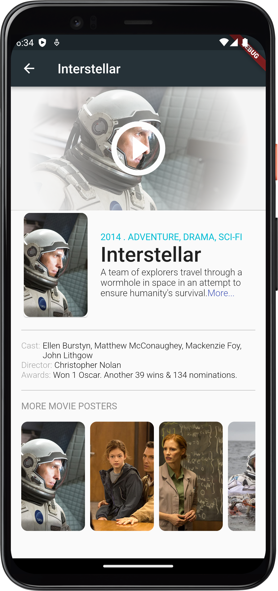
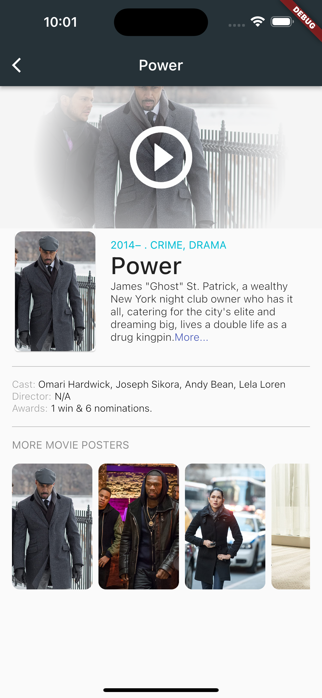

# Flutter Movies Aap

A Flutter Movie App project based on Udemy course => Build Flutter iOS and Android Apps with a Single Codebase: Learn Google's Flutter Mobile Development Framework & Dart.

## Screenshots and Videos

    

     
     

     
     

